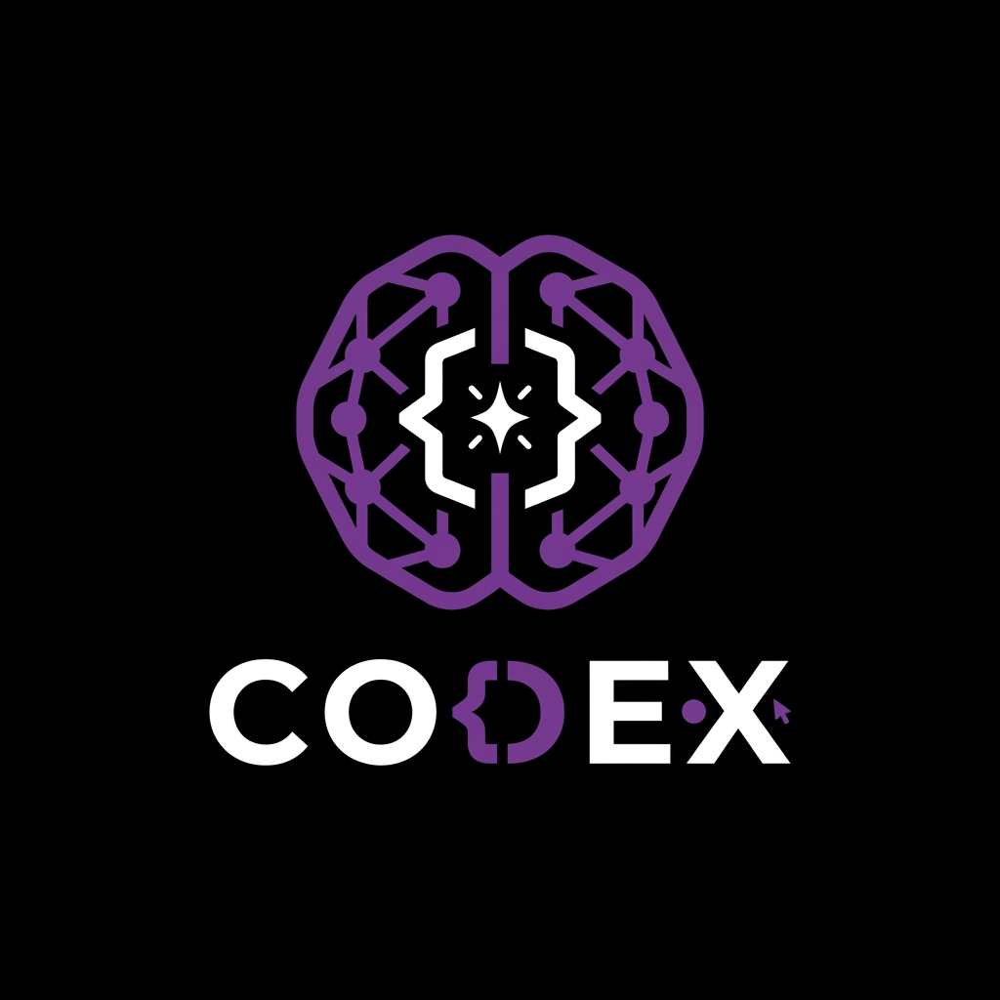
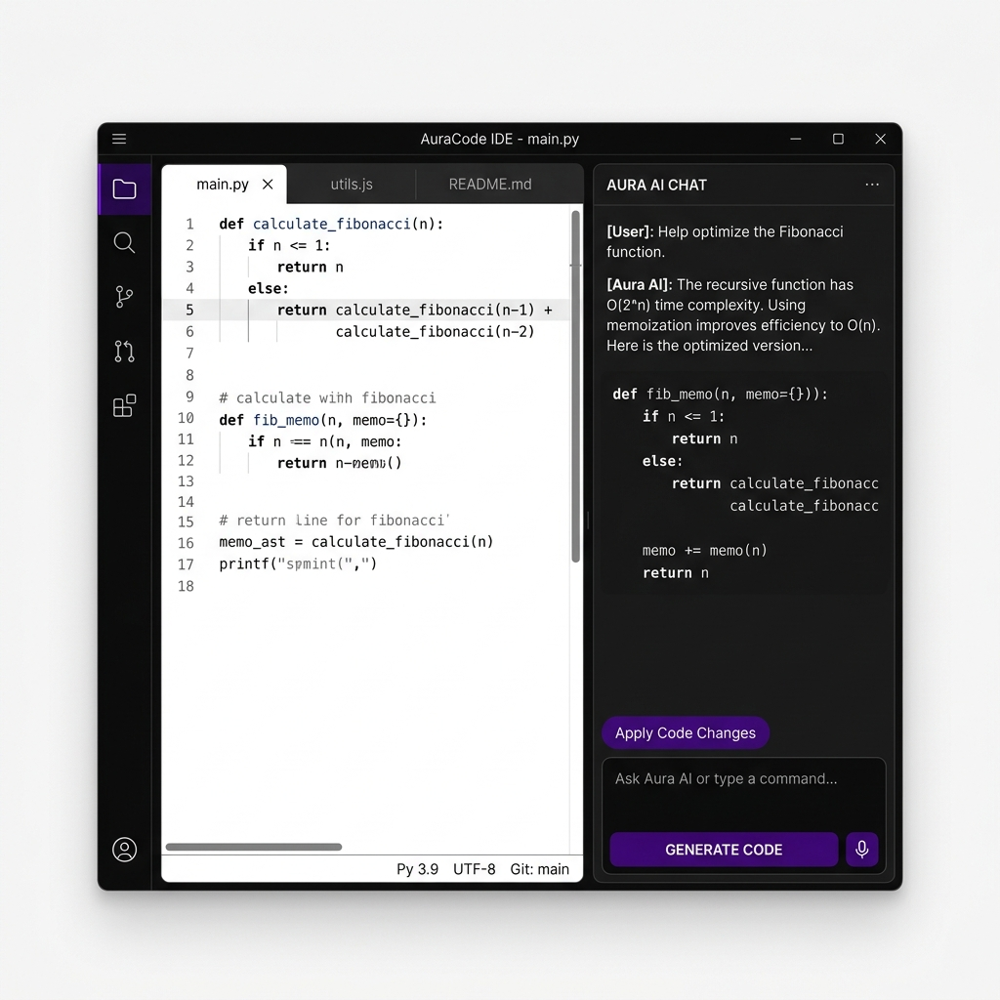

# Codex 辅助工具 Visual Identity (VI) 规范

本规范定义了 Codex 辅助工具（客户端及官网）的视觉语言核心特征，确保多端和各大界面间的视觉一致性、专业性与辨识度。

## 1. 核心理念 (Core Philosophy)

**“极简至黑，一抹幽紫”**

Codex 辅助工具的视觉语言旨在**降噪**。作为 AI 代码辅助工具，界面的主角永远是**代码**与**AI 逻辑交互**。
我们抛弃任何不必要的发光、渐变、拟物隐喻，仅采用绝对的黑白灰层次，通过唯一的色彩（紫色）作为焦点指引。

---

## 2. 色彩空间 (Color System)

系统中的颜色变量按使用意图进行语义化定义。只有在强调强交互操作或 AI 激活状态时才会使用到品牌核心颜色。

### 品牌主点缀紫 (Brand Focus Purple)
**应用场景**：激活状态（Active）、主动作按钮（CTA）、选中文本背景（Alpha混合）、AI思考/生成进度条指示器。
- **Primary Violet**: `#8A2BE2` (或相近的高饱和度亮紫调)
- **Hover/Glow**: `#9D4EDD`
- **Pressed**: `#7B2CBF`

### 灰度与黑白基调 (Monochrome Palette)
**应用场景**：背景、面、排版、次要边界线。
- **App Background (主黑)**: `#09090B` 或 `#000000` (最深的背景，给代码区极大对比)
- **Surface / Panels (次黑)**: `#18181B` (用于侧边 Chat 气泡底色、设置弹出面板)
- **Borders / Separators (暗线)**: `#27272A` (极细边框或分隔线，无阴影)
- **Text Primary (白)**: `#FAFAFA` (阅读层顶级文字)
- **Text Secondary (灰白)**: `#A1A1AA` (注释、副文本、未激活图标)

---

## 3. Logo 设计规范 (Logo Specifications)

### 3.1 静态 Logo
- **视觉特质**：黑白加单紫色的极简扁平线条构成，或为象征着代码的几何图形（例如 `< >`，`{ }` 融合了神经元、火花闪念的设计）。
- **空间与留白**：使用黑色或透明背景，保证白色或紫色线条高亮锐利。

### 3.2 动态 Logo (官网 Motion Logo)
在官网 Landing Page 中展示时，结合光影渲染实现微妙动效（可通过 JS 与 CSS Keyframes 配合：
- **脉搏呼吸**：围绕核心结构的线条以非常长周期的缓动进行淡紫色霓虹呼吸。
- **解析完成动效**：核心图形展开/转动后高亮全紫，表现“代码生成完毕/思考完毕”。
（请参考 `docs/motion-logo-demo.html` 的原型演示）。

---

## 4. 客户端 UI 规范 (Client UI Elements)

### 4.1 按钮 (Buttons)
- **Primary Button**：紫色底，纯白字。无圆角或极小圆角 (2px-4px)，彰显专业和开发工具特质。移除所有外扩投影（Drop Shadow）。
- **Secondary Button**：透明底，白色细边框与文字，悬停泛灰底色。

### 4.2 容器与面板 (Cards & Panels)
- 放弃厚重阴影，主要以色块差异（`#09090B` 与 `#18181B`）分割面板。
- 可使用极细的边框（`1px solid #27272A`）进行微弱隔离。
- 半透明模糊（Glassmorphism / Backdrop Filter）仅建议谨慎在需要焦点突出的下拉菜单底层极少量使用。

### 4.3 排版与图标 (Typography & Icons)
- **字体族**：英文字体使用 `Inter` 进行系统文字排版，使用 `Fira Code` 或是 `JetBrains Mono` 作为代码展示字体。
- **Icon**：线条（Line/Stroke）风格图标。未选中为灰度色 (`#A1A1AA`)，激活或选中变为品牌紫 (`#8A2BE2`)，杜绝多色拟物 Icon。

